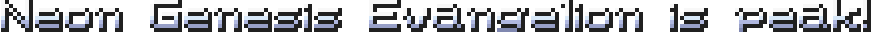
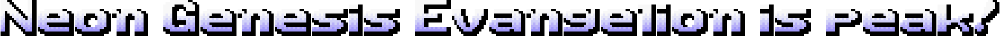
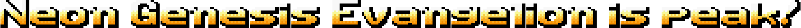

# Metal Slug Font Examples

## Font 1
- **Blue:** 
  

- **Orange:** 
  

- **Gold:** 
  

## Font 2
- **Blue:** 
  

- **Orange:** 
  

- **Gold:** 
  

## Font 3
- **Blue:** 
  

- **Orange:** 
  

## Font 4
- **Blue:** 
  

- **Gold:** 
  

- **Yellow:** 
  

## Font 5
- **Orange:** 
  

## Advanced Mode

> **Beta:** Advanced Mode is still experimental. The core editing
> works, but you may run into some really stupid issues...

Enable **Advanced Mode** under Options, and the Generate button becomes
**Generate & Edit**. Instead of saving directly, a per-character editor
opens where every character is a draggable sprite:

- **Per character** - drag on canvas, X/Y offset, scale (50–200%)
  and rotation (±180°). While snapping is enabled, dragged characters
  click onto other characters' edges, centres and baselines with
  magenta Photoshop-style guide lines (pixel-grid fallback). Double-
  click a character to replace it with any text - one letter or a
  whole phrase like `I LOVE CATS`.
  Right-click a character to reset scale/rotation or delete it.
- **Multi-select** — Ctrl+click or marquee-select, then move/scale/
  rotate the whole group at once.
- **Spacing & alignment** - letter spacing, line spacing, vertical
  alignment within lines (top/center/bottom) and line alignment on the
  canvas (left/center/right).
- **Undo/redo** = Ctrl+Z / Ctrl+Shift+Z (or Ctrl+Y) cover every
  editing action, up to 30 steps.
- **Export** — uses the main window's compression and scale settings;
  what you see on the canvas is exactly what gets exported.
