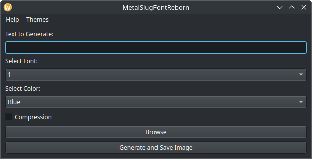

# **Linux:**

1. Get the latest release of [MetalSlugFontReborn](https://github.com/VermeilChan/MetalSlugFontReborn/releases/latest).

   

2. **Extract the Archive:**
   - Extract `MetalSlugFontReborn-vX.X.X-Linux-x64-Qt-Console.tar.xz`.

3. **Install Dependencies:**
   - Navigate to the `MetalSlugFontReborn` folder in the terminal.
   - Run the following command:
      ```sh
      # Requires Python 3.9 or later

      bash Install-Deps.sh

      # Or

      chmod +x Install-Deps.sh
      ./Install-Deps.sh
      ```

4. **Run MetalSlugFontReborn:**
   - Launch MetalSlugFontReborn after the installation script completes:
      ```sh
      bash Run.sh

      # Or

      chmod +x Run.sh
      ./Run.sh
      ```

3. **Select a Font:**
   - Upon opening MetalSlugFontReborn, choose your desired font and color, you can [preview](EXAMPLES.md) here.
   
  Qt Version:

 

  Console Version:

  

4. **Input Your Text:**
   - Enter the text you want to convert to the metal slug font.

5. **Generate the Image:**
   - Click `Generate And Save Image` to create the stylized image.

6. **View the Result:**
   - The program will save the stylized image. By default, it will be saved on your desktop. You can choose a different location if desired.
