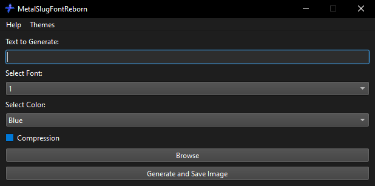

# **Windows:**

1. Get the latest release of [MetalSlugFontReborn](https://github.com/VermeilChan/MetalSlugFontReborn/releases/latest).

   

**Extract and Run MetalSlugFontReborn:**
   - Locate and extract `MetalSlugFontReborn-vX.X.X-Windows-x64-Qt.7z` or `MetalSlugFontReborn-vX.X.X-Windows-x64-Console.7z`.
   - Go to the `MetalSlugFontReborn` folder.
   - Run `MetalSlugFontReborn.exe`.

3. **Select a Font:**
   - Upon opening MetalSlugFontReborn, choose your desired font and color, you can [preview](EXAMPLES.md) here.
   
  Qt Version:

 

  Console Version:

  

4. **Input Your Text:**
   - Enter the text you want to convert to the metal slug font.

5. **Generate the Image:**
   - Click `Generate And Save Image` to create the stylized image.

6. **View the Result:**
   - The program will save the stylized image. By default, it will be saved on your desktop. You can choose a different location if desired.
