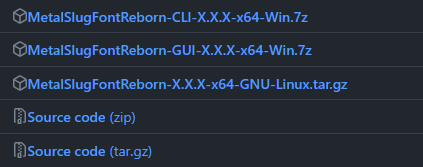
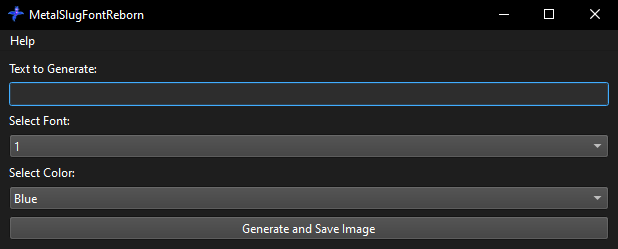

# **Windows:**

1. Download MetalSlugFontReborn:

   - Get the latest release of MetalSlugFontReborn from [here](https://github.com/VermeilChan/MetalSlugFontReborn/releases).

   

**Extract and Run MetalSlugFontReborn:**
   - Locate and extract `MetalSlugFontReborn-X.X.X-x64-Win.7z`.
   - Go to the `MetalSlugFontReborn-X.X.X-x64-win` folder.
   - Run `MetalSlugFontReborn.exe`.

3. **Select a Font:**
   - Upon opening MetalSlugFontReborn, choose your desired font and color, you can preview them in [EXAMPLE.md](Documentation/EXAMPLE.md).

   

4. **Input Your Text:**
   - Enter the text you want to convert to the metal slug font.

5. **Generate the Image:**
   - Click `Generate And Save Image` to create the stylized image.

6. **View the Result:**
   - The program will save the stylized image on your desktop.
