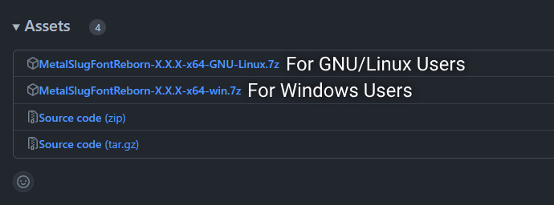
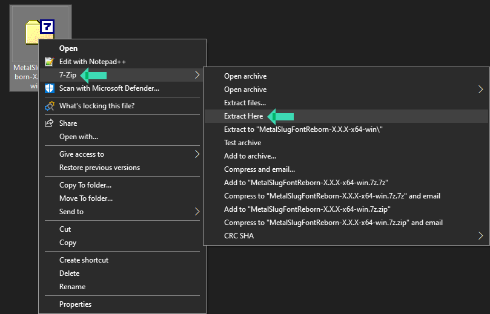
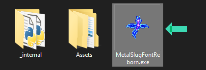
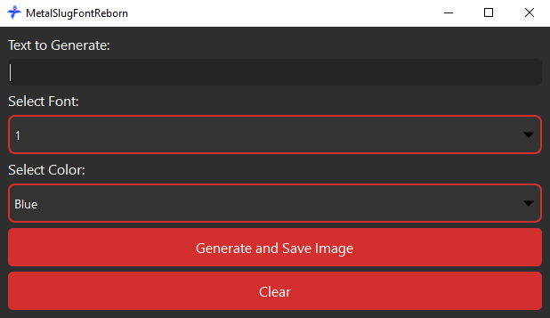

**Windows:**

1. **Download MetalSlugFontReborn:**
   - Get the latest stable release of MetalSlugFontReborn from the [Releases Page](https://github.com/VermeilChan/MetalSlugFontReborn/releases).

      

2. **Extract Archive And Run MetalSlugFontReborn:**
   - Locate the downloaded file `MetalSlugFontReborn-X.X.X-x64-win.7z` and extract it.

   

   - Go inside `MetalSlugFontReborn-X.X.X-x64-win` folder and run `MetalSlugFontReborn.exe`.

   

3. **Select a Font:**
   - When MetalSlugFontReborn opens, you can choose your perfected font and color. You can preview them in [EXAMPLE.md](EXAMPLE.md).

      

4. **Input Your Text:**
   - Enter the text you want to transform into Metal Slug style.

5. **Generate the Image:**
   - Click `Generate And Save Image` to create the stylized image.

6. **View the Result:**
   - After Clicking `Generate And Save Image`, the program will save the stylized image on your desktop.

---

**GNU/Linux:**

1. **Download MetalSlugFontReborn:**
   - Download the latest stable release of MetalSlugFontReborn from the [Releases Page](https://github.com/VermeilChan/MetalSlugFontReborn/releases).

   

2. **Extract the Archive:**
   - Locate the downloaded file `MetalSlugFontReborn-X.X.X-x64-GNU-Linux.7z` and extract it.
   - Go inside `MetalSlugFontReborn-X.X.X-x64-GNU-Linux` folder.

2. **Install Dependencies:**
   - Open a terminal in the same directory and run the following commands:
   - Run the installation script to download and install dependencies:
     ```bash
     python3 Install-Deps.py
     ```

3. **Run MetalSlugFontReborn:**
   - After the installation script finishes, you can launch MetalSlugFontReborn:
   ```sh
   # (GUI version by default, command line if GUI fails)
   bash Run.sh
   ```
