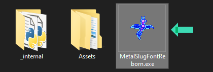

# **Windows:**

1. **Download MetalSlugFontReborn:**
   - Get the latest stable release of MetalSlugFontReborn from the [Releases Page](https://github.com/VermeilChan/MetalSlugFontReborn/releases).

      

2. **Extract Archive And Run MetalSlugFontReborn:**
   - Locate the downloaded file `MetalSlugFontReborn-X.X.X-x64-win.7z`. 
   - Extract it.

   

   - Go inside `MetalSlugFontReborn-X.X.X-x64-win` folder.
   - Run `MetalSlugFontReborn.exe`.

   

3. **Select a Font:**
   - When MetalSlugFontReborn opens, you can choose your perfected font and color.
   - You can preview them in [EXAMPLE.md](Documentation/EXAMPLE.md).

      

4. **Input Your Text:**
   - Enter the text you want to transform into Metal Slug font.

5. **Generate the Image:**
   - Click `Generate And Save Image` to create the stylized image.

6. **View the Result:**
   - After Clicking `Generate And Save Image`, the program will save the stylized image on your desktop.

---

# **GNU/Linux:**

1. **Download MetalSlugFontReborn:**
   - Download the latest stable release of MetalSlugFontReborn from the [Releases Page](https://github.com/VermeilChan/MetalSlugFontReborn/releases).

   

2. **Extract the Archive:**
   - Extract `MetalSlugFontReborn-X.X.X-x64-GNU-Linux.7z` after downloading.

   

3. **Install Dependencies:**
   - Go inside `MetalSlugFontReborn-X.X.X-x64-GNU-Linux` folder.
   - Open a terminal inside `MetalSlugFontReborn-X.X.X-x64-GNU-Linux` folder and run the following command:
     ```bash
      bash Install-Deps.sh

      # Or

      chmod +x Install-Deps.sh
      ./Install-Deps.sh
      ```

4. **Run MetalSlugFontReborn:**
   - After the installation script finishes, you can launch MetalSlugFontReborn:
      ```sh
      bash Run.sh

      # Or

      chmod +x Run.sh
      ./Run.sh
      ```

**Follow the Same Steps as Windows:**
   - Follow steps 3 to 6 from the Windows guide to choose a font, input your text, generate the image, and view the result.
