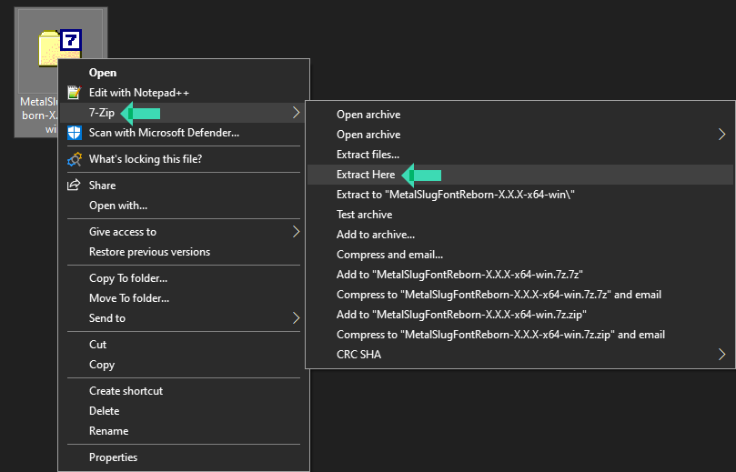
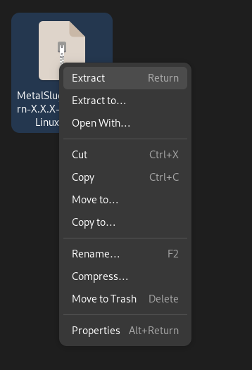

# **Windows:**

1. **Download MetalSlugFontReborn:**
   - Obtain the latest stable release of MetalSlugFontReborn from the [Releases Page](https://github.com/VermeilChan/MetalSlugFontReborn/releases).

   

2. **Extract Archive And Run MetalSlugFontReborn:**
   - Locate and extract the downloaded file `MetalSlugFontReborn-X.X.X-x64-win.7z`.
   - Navigate to the `MetalSlugFontReborn-X.X.X-x64-win` folder.
   - Run `MetalSlugFontReborn.exe`.

   

3. **Select a Font:**
   - Upon opening MetalSlugFontReborn, choose your desired font and color, previewing them in [EXAMPLE.md](Documentation/EXAMPLE.md).

   

4. **Input Your Text:**
   - Enter the text for transformation into the Metal Slug font.

5. **Generate the Image:**
   - Click `Generate And Save Image` to create the stylized image.

6. **View the Result:**
   - The program will save the stylized image on your desktop after clicking `Generate And Save Image`.

---

# **GNU/Linux:**

1. **Download MetalSlugFontReborn:**
   - Download the latest stable release from the [Releases Page](https://github.com/VermeilChan/MetalSlugFontReborn/releases).

   

2. **Extract the Archive:**
   - Extract `MetalSlugFontReborn-X.X.X-x64-GNU-Linux.7z` after downloading.

   

3. **Install Dependencies:**
   - Navigate to the `MetalSlugFontReborn-X.X.X-x64-GNU-Linux` folder in the terminal.
   - Run the following command:
      ```bash
      bash Install-Deps.sh

      # Or

      chmod +x Install-Deps.sh
      ./Install-Deps.sh
      ```

4. **Run MetalSlugFontReborn:**
   - Launch MetalSlugFontReborn after the installation script completes:
      ```bash
      bash Run.sh

      # Or

      chmod +x Run.sh
      ./Run.sh
      ```

**Follow the Same Steps as Windows:**
   - Refer to steps 3-6 from the Windows guide for choosing a font, inputting text, generating an image, and viewing the result.
