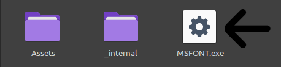

# MSFONT: Creating Metal Slug-Style Text

Easily transform your text into Metal Slug-style graphics with MSFONT. Follow these straightforward steps to get started:

## 1. Download MSFONT

Begin by downloading the latest stable release of MSFONT from the [Releases Page](https://github.com/VermeilChan/MetalSlugFontReborn/releases).

## 2. Installation and Launch

1. Locate the downloaded `MSFONT` folder.
2. Run the `MSFONT-Dev.exe` executable inside the folder.
   - For Windows:

     

   - For Linux:

     

## 3. Select a Font

Upon launching MSFONT, you will be asked to choose a font. Pick a font by entering a number from 1 to 5. To see how they look, check out the examples in [EXAMPLE.md](EXAMPLE.md).

## 4. Choose a Color

Depending on your selected font, you will have different color options:

- For some fonts, type `Blue` for the color Blue.
- For specific fonts, type `Orange-1` for Orange 1.
- For other fonts, type `Orange-2` for Orange 2.

## 5. Input Your Text

After choosing the font and color, the program will prompt you to enter the text you want to transform into Metal Slug style.

## 6. Generate the Image

Simply input your desired text and press 'Enter.'

## Viewing the Result

Once you press 'Enter,' the program will generate the stylized text image, which will be saved to your desktop.
