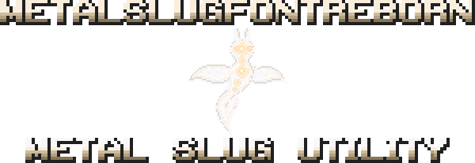

# MetalSlugFontReborn

  

  
  
  
  
  
  
  

# A tool for creating images with the iconic Metal Slug font

## Table of Contents

- [Key Features](#key-features)
- [Previewing Fonts](#previewing-fonts)
  - [MSFONT Usage Guide](#msfont-usage-guide)
- [Contributing](#contributing)
- [License](#license)
- [Acknowledgments](#acknowledgments)
  - [Contact](#contact)

## Key Features

- Transform text into images using the iconic Metal Slug font.
- Supports uppercase and lowercase alphabets (A-Z, a-z), numbers (0-9), and symbols.
- Minimal resource usage: Requires less than 40MB of disk space and RAM.

For additional details, please refer to [**SUPPORTED.md**](Documentation/SUPPORTED.md).

## Previewing Fonts

Explore visual samples of fonts in action by checking out [**EXAMPLE.md**](EXAMPLE.md).

## MSFONT Usage Guide

1. Open MSFONT, and you'll be greeted with a font selection prompt.
2. Select a font by typing a number from 1 to 5.
3. The available color options will adjust based on your font choice.
4. To create Metal Slug font images, follow on-screen instructions or refer to the [**Setup Guide**](INSTALL.md) and [**Supported Characters**](Documentation/SUPPORTED.md).
5. Specify the color for your chosen font:
   - For some fonts, use `Blue`.
   - For specific fonts, select `Orange-1`.
   - For other fonts, pick `Orange-2`.
   - For other fonts, use `Yellow`
6. Your resulting image will be automatically saved on your desktop for convenient access. Enjoy using MSFONT!

## Contributing

If you find issues or have ideas for improvements, please:

- [**Report an issue**](https://github.com/VermeilChan/MetalSlugFontReborn/issues)
- [**Submit a pull request**](https://github.com/VermeilChan/MetalSlugFontReborn/pulls)

Your input and involvement are essential in enhancing this project.

## License

This project is licensed under the [**Apache License 2.0**](LICENSE).

## Acknowledgments

I want to express my sincere thanks to the following individuals and groups for their valuable contributions and support:

- [**Division 六**](https://6th-divisions-den.com/): Provided Fonts 1, 2, 3, and 4 assets.
- [**BinRich**](https://discord.com/users/477459550904254464/): Supplied diacritic marks.
- [**GussPrint**](https://www.spriters-resource.com/submitter/Gussprint/): Shared assets for Font 5.

## Contact

If you have any questions, suggestions, or need assistance, feel free to reach out to me through the following platforms:

- **Discord:** [mommy_vermeil](https://discord.com/users/857841811736100925) (Most active GMT+1)
- **Twitter:** [@VermeilChan2](https://twitter.com/VermeilChan2)
- **GitHub Issues:** [Project Issues](https://github.com/VermeilChan/MetalSlugFontReborn/issues) (Active)
- **Reddit:** [_Vermeil_](https://www.reddit.com/user/_Vermeil_)
- **Stack Overflow:** [Vermeil](https://stackoverflow.com/users/20787000/vermeil)

I'm quickest to respond on Discord and GitHub, so those are the best options for timely assistance.
