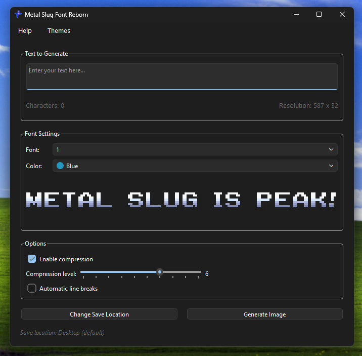

# MetalSlugFontReborn

**A sleek, cross-platform desktop application for generating Metal Slug text art.**

  
  
  
  

  
  
  
  
  
  
  
  
  

> 💡 **Enjoy the project?** 
> If you have a GitHub account and found this repository helpful, please consider giving it a ⭐! It helps others discover the tool and it makes me happy!

# Overview

MetalSlugFontReborn is a free, open-source desktop app built with PySide6 and Pillow that generates images from text using sprite-based fonts extracted from the Metal Slug series. It supports multiple font styles, color variations, live previews, line wrapping, compression options.

## Table of Contents

- [Features](#features)
- [System Requirements](#system-requirements)
- [Installing MetalSlugFontReborn](#installing-metalslugfontreborn)
- [Examples and Supported Characters](#examples-and-supporteds-characters)
- [How to Contribute](#how-to-contribute)
- [License](#license)
- [Credits](#credits)

## Features

- **Multiple Font Styles** - Choose from 5 Metal Slug font variations
- **Rich Color Palette** - Blue, Orange, Gold, and Yellow variants
- **Real-time Preview** - See your text rendered instantly as you type
- **Theme Support** - Light, Dark, and Tokyo Night themes
- **Cross-platform** - Works natively on Windows, macOS, and Linux.
- **On-the-Fly Compression** - Adjustable PNG compression levels (0-9) to balance file size.
- **Character Support Reference** - A built-in, easy-to-read guide showing exactly which characters and symbols are supported by each font!

## System Requirements

#### Operating Systems

| Operating System | Supported Versions                             | Architecture | Tested |
|------------------|------------------------------------------------|--------------|--------|
| Windows          | 11, 10 (1809 or later)                         | 64-Bit       |   ✅   |
| GNU/Linux        | Debian 13, Ubuntu 26.04, Fedora 44, Arch Linux | 64-Bit       |   ✅   |
| macOS            | 13 (Ventura) and later                         | ARM64        |   ❌   |

> **macOS:** Built for Apple Silicon. I don't own a Mac to verify, but it should work.

> **Linux:** Tested on the distributions above with Wayland. If the app crashes when typing, switch your display server to Wayland that usually fixes it. You can also use the [web app](https://vermeil.pythonanywhere.com/) (same features, no install) or [build from source](Docs/BUILD.md) (it's easy, trust me!)

### Resource Footprint
- **RAM Usage:** ~35-110MB (varies with OS)
- **Disk Space:** ~120-290MB (varies with OS)

> If your system doesn't meet these requirements, try the [web app](https://vermeil.pythonanywhere.com/) it runs in any modern browser.

## Installing MetalSlugFontReborn

To download and use MetalSlugFontReborn, See the **[installation guide](Docs/INSTALL-SELECT.md)** to find the right method for your OS, pre-built binaries are available for all supported platforms.

## Examples & Supported Characters

- [View generated image examples](Docs/EXAMPLES.md)
- [Browse supported characters by font](Docs/SUPPORTED.md)

## How to Contribute

1. **Found a bug?** → [Open an issue](https://github.com/Mitra-88/MetalSlugFontReborn/issues) with steps to reproduce
2. **Have an idea?** → [Start a discussion or open a feature request](https://github.com/Mitra-88/MetalSlugFontReborn/issues)
3. **Want to contribute code?** → Fork the repo, make your changes, and [submit a pull request](https://github.com/Mitra-88/MetalSlugFontReborn/pulls)

Please check existing issues and PRs before opening a new one to avoid duplicates.

## License

This project is licensed under the [GNU General Public License v3.0](LICENSE).

## Credits

I want to say a big thank you to the individuals who helped me.

- [SNK Corporation](https://www.snk-corp.co.jp): Used some of their assets.
- [AmbitiousFlowDev](https://github.com/AmbitiousFlowDev): for assisting in the development of the program and webapp.
- [Division 六](https://6th-divisions-den.com): inspiring me to create the program in the first place and providing assets for fonts 1 to 4.
- [GussPrint](https://www.spriters-resource.com/submitter/Gussprint): for providing assets for font 5.
- [BinRich](https://discord.com/users/477459550904254464): for providing diacritic marks.

### Tools & Technologies

- [PySide6](https://doc.qt.io/qtforpython-6/): For the GUI
- [Pillow](https://pillow.readthedocs.io/en/stable/): For image processing
- [PyInstaller](https://pyinstaller.org/en/stable): For compiling the program
- [Python Prompt Toolkit](https://python-prompt-toolkit.readthedocs.io/en/master/): For the CLI Autocompletion
- [Ruff](https://docs.astral.sh/ruff/): Python linter and code formatter.
- [SkyblockerMod](https://github.com/SkyblockerMod/Skyblocker): Issue Template.
- [Aseprite](https://github.com/aseprite/aseprite): Build template.

## Disclaimer

To be absolutely clear: I do not own any of the Metal Slug assets, nor is this project affiliated with or endorsed by SNK. This is simply a passion project made by a fan, for other fans who need to generate this text as much as I did! All rights to the original characters, fonts, and assets belong to SNK.

_Made with ❤️ by Mitra-88_
